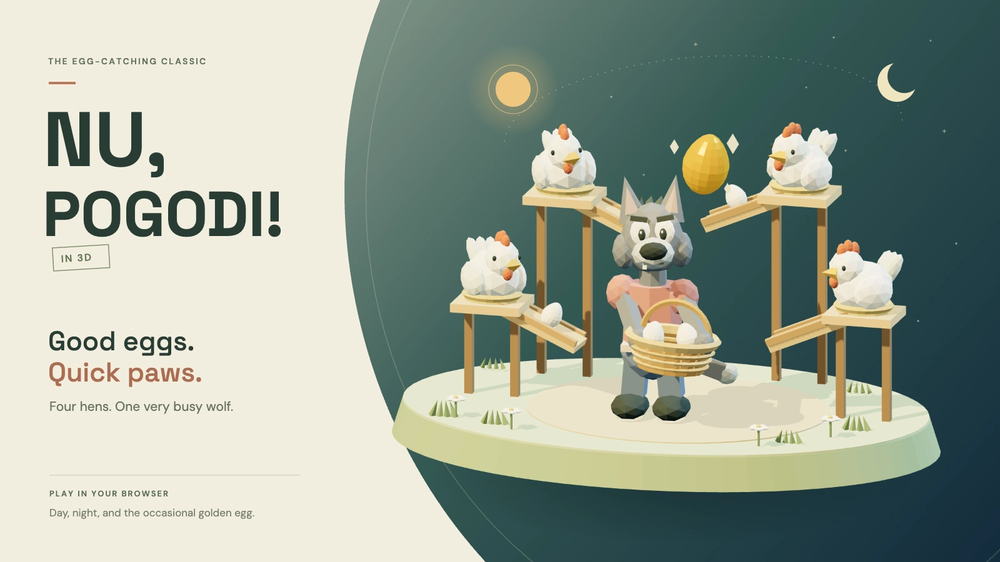

# Nu, Pogodi! 3D

[](https://kopenkinda.github.io/slop-pogodi/)

A 3D fan remake of the classic egg-catching game. Move the wolf's basket between four ramps and catch breakfast before it hits the ground.

[Play the game](https://kopenkinda.github.io/slop-pogodi/) · [Read the build conversation](SLOP-CHAT.md)

Built with vanilla JavaScript, Three.js, and Vite. The farm, characters, eggs, and sound effects are generated in code. Fonts are bundled locally. No backend, model downloads, or API keys are needed.

## How to play

Choose one of the four basket positions to catch eggs at the end of their ramp. Three missed eggs end the round.

| Egg | Spawn chance | Speed | Points |
| --- | --- | --- | --- |
| White | 95% | Normal | 1 |
| Golden | 5% | Twice normal speed | 5 |

A missed egg of either kind costs one life. Each ten points raises the level, increasing egg speed and spawn frequency until their limits. Your personal best stays in your browser.

| Control | Action |
| --- | --- |
| Q / A | Upper left / lower left |
| E / D | Upper right / lower right |
| Arrow keys | Change side or height |
| Touch or click the four arrow buttons | Move the basket |
| Space or P | Start, pause, resume, or restart after a round |
| Escape | Pause or resume |

Switching away from the page pauses the game. Opening **How to play** pauses the round and resumes it when the dialog closes. Sound starts after a user gesture and can be muted.

The theme dial switches between day and night. The sun and moon follow a circular path in both the toggle and the farm, rotating in the same direction while the scene's lighting changes. Theme and sound preferences are saved locally. Theme transitions and decorative animation respect reduced-motion settings.

<details>
<summary>The Easter egg</summary>

Lose with more than 50 points to unlock a bonus scene. A rabbit hops onto the farm and tosses an oversized golden egg into the wolf's basket, then the wolf and hens celebrate.

The scene lasts 8.5 seconds. Skip it with the on-screen button, Space, or Escape. A score of exactly 50 does not unlock it.

</details>

## Install on a phone

Open the [live game](https://kopenkinda.github.io/slop-pogodi/) and tap **Install**.

- On iPhone, use the browser's Share menu, select **Add to Home Screen**, then **Add**. Keep **Open as Web App** enabled if offered.
- On Android, accept the browser's install prompt or choose **Install app** from its menu.

The installed app opens directly to the game with score, lives, large touch arrows, theme, mute, and pause/play controls. The website header, intro, instructions, and footer are hidden. Portrait and landscape layouts account for screen cutouts.

The game and fonts are cached after the first online visit so later launches work offline. Updates activate after the app and any open game tabs close, avoiding a reload during a round.

## Run locally

Use Node.js 24, matching the deployment workflow, and npm. Run these commands from the project directory:

```sh
npm ci
npm run dev
```

Open the URL printed by Vite. The app uses the `/slop-pogodi/` path locally and in production. A browser with WebGL support is required.

```sh
npm test       # Gameplay checks using Node's built-in test runner
npm run build  # Production bundle in dist/
npm run preview
```

To check installation and offline behavior locally, use the production preview. The service worker is disabled in development. Visit the preview online first, let the service worker finish installing, then reload before trying an offline launch.

## Project files

| File | Responsibility |
| --- | --- |
| [src/game.js](src/game.js) | Gameplay rules, spawning, catches, scoring, difficulty, and round state |
| [src/scene.js](src/scene.js) | Procedural Three.js models, lighting, animation, and the bonus scene |
| [src/main.js](src/main.js) | Input, interface, audio, saved preferences, and install controls |
| [src/style.css](src/style.css) | Themes, responsive layout, and the minimal installed interface |
| [index.html](index.html) | Page structure, game controls, and dialogs |
| [src/game.test.js](src/game.test.js) | Catching, golden eggs, level changes, bonus ending, pause, and restart checks |
| [public/](public/) | App icons, bundled fonts, and font licenses |
| [vite.config.js](vite.config.js) | Build path, PWA manifest, and offline caching |
| [.github/workflows/deploy.yml](.github/workflows/deploy.yml) | GitHub Pages deployment |

## Deployment

Every push to `main` in [kopenkinda/slop-pogodi](https://github.com/kopenkinda/slop-pogodi) installs dependencies, runs the gameplay tests, builds the site, and deploys `dist/` to GitHub Pages.

The Vite base path and the PWA manifest's ID, start URL, and scope are set to `/slop-pogodi/` for this repository.

## Credits

Inspired by the [Elektronika Nu, Pogodi! handheld](https://www.deutsche-digitale-bibliothek.de/item/3QUYS35WLMMSWZWS2NVU3E6J2X4J34VL). This is an independent fan project with original procedural artwork.

DM Sans and Space Grotesk are bundled under their open font licenses in [public/fonts/](public/fonts/).
